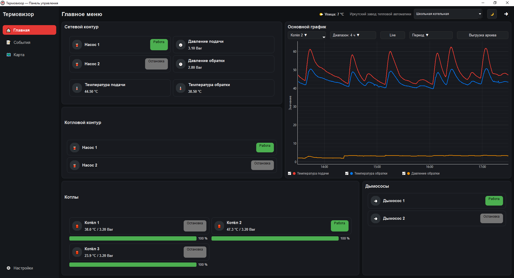
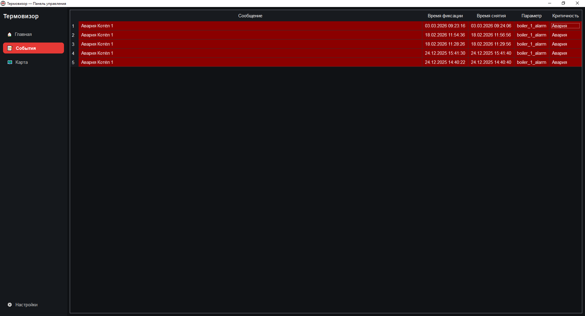
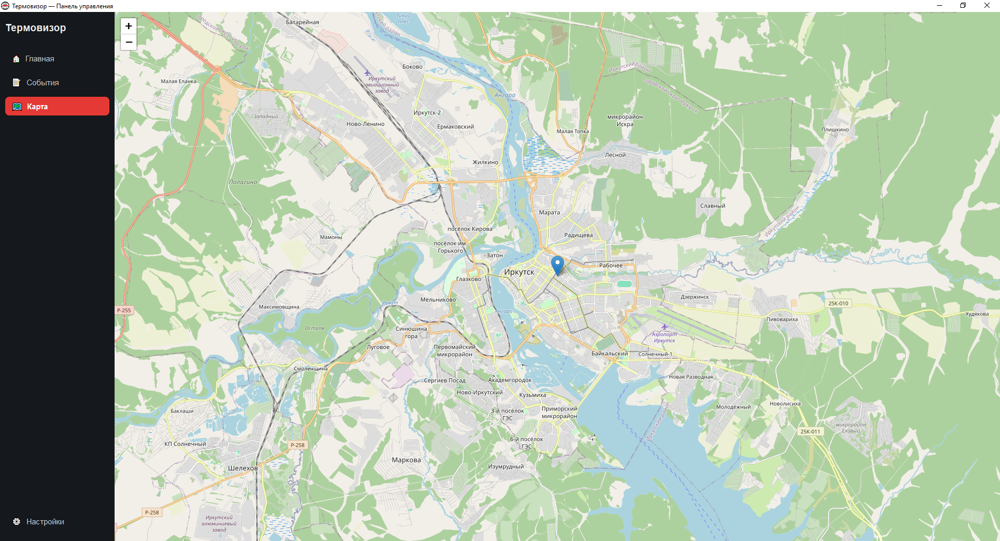
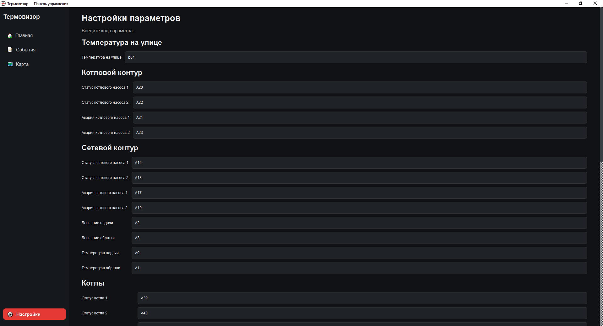
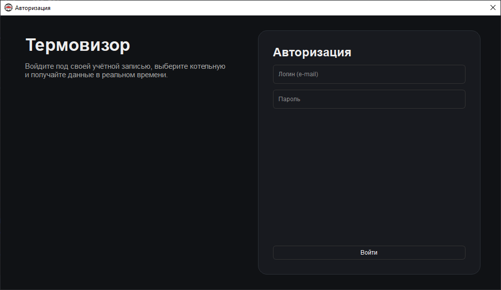
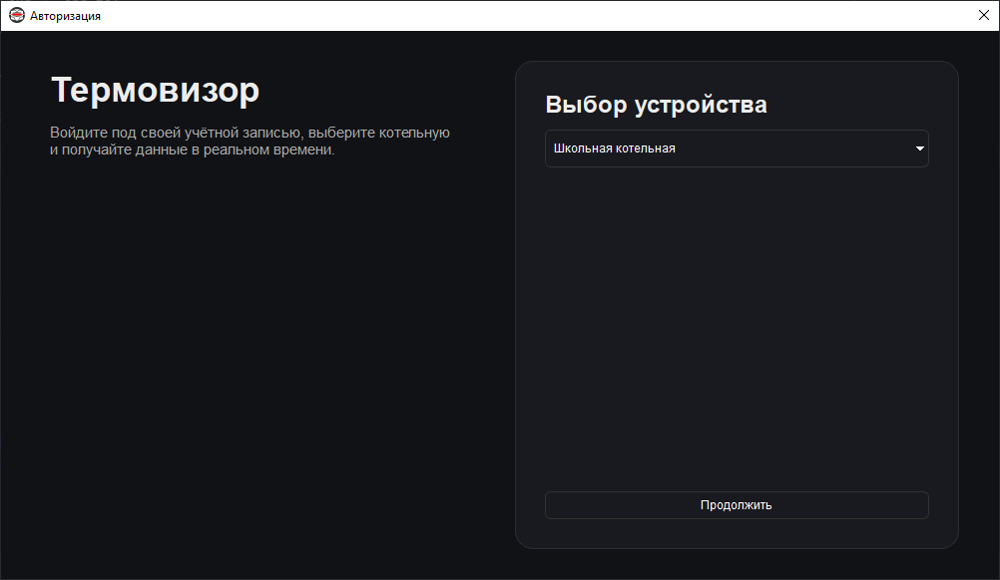

# SCADA Desktop Termovizor

Desktop SCADA application for monitoring boiler houses via OwenCloud API.

Десктопное SCADA-приложение для мониторинга котельных через OwenCloud API.

---

# ru Русская версия

## Описание

SCADA Desktop Termovizor — это приложение для мониторинга параметров котельной в реальном времени через облачный сервис **OwenCloud**.

Приложение отображает основные технологические параметры котлов, события, аварии и графики изменения параметров.

---

## Основные возможности

- мониторинг всех возможных параметров (температура подачи, температура обратки, давление подачи, статусы насосов, котлов, дымососов)
- поддержка нескольких котлов
- быстрое переключение между котельными
- отображение событий и аварий
- график отображения реальных значений параметров
- история графика
- карта расположения котельных
- светлая и тёмная тема интерфейса
- настройка кодов параметров
- выгрузка архива за определнный период со значениями в формате xlsx

---

## Скриншоты

### Панель мониторинга

### События

### Карта котельных

### Настройки параметров

### Окно авторизации

### Окно выбора котельной

---

## Технологии

- Python
- PyQt6
- PyQtGraph
- SQLite
- OwenCloud API
- Leaflet (карта)

---

## Архитектура проекта

- api/ — клиент OwenCloud API
- models/ — модели данных и логика событий
- services/ — сервисы хранения данных
- ui/ — интерфейс приложения
- widgets/ — пользовательские виджеты
- utils/ — вспомогательные функции
- web/ — HTML карта (Leaflet)

---

# en English version

## Description

SCADA Desktop Termovizor is a desktop application for real-time monitoring of boiler house parameters using the **OwenCloud** cloud service.

The application displays key technological parameters of boilers, events, alarms, and historical parameter graphs.

---

## Main Features

- monitoring of all available parameters (supply temperature, return temperature, supply pressure, pump status, boiler status, exhaust fan status)
- support for multiple boilers
- fast switching between boiler houses
- event and alarm monitoring
- real-time parameter graph visualization
- historical graph data
- map with boiler house locations
- light and dark UI themes
- parameter code configuration
- exporting historical parameter data to **.xlsx** for a selected time period

---

## Screenshots

### Monitoring Dashboard

### Events

### Boiler House Map

### Parameter Settings

### Login Dialog

### Boiler House Selection

---

## Technologies

- Python
- PyQt6
- PyQtGraph
- SQLite
- OwenCloud API
- Leaflet (map)

---

## Project Architecture

- api/ — OwenCloud API client
- models/ — data models and event logic
- services/ — data storage services
- ui/ — application interface
- widgets/ — custom UI widgets
- utils/ — helper utilities
- web/ — HTML map (Leaflet)
